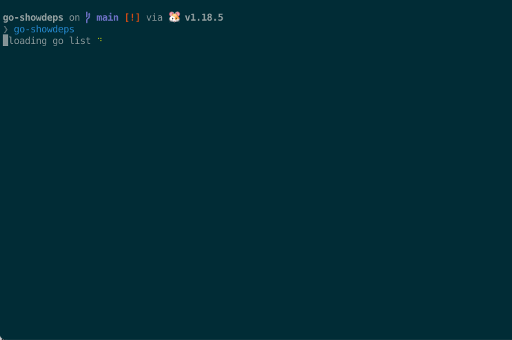

<a name="readme-top"></a>

<!-- PROJECT SHIELDS -->
[![Contributors][contributors-shield]][contributors-url]
[![Forks][forks-shield]][forks-url]
[![Stargazers][stars-shield]][stars-url]
[![Issues][issues-shield]][issues-url]
[![MIT License][license-shield]][license-url]

<!-- PROJECT LOGO -->
<br />
<div align="center">

<h3 align="center">go-showdeps</h3>
  <p align="center">
		An interactive terminal UI for navigating your Go project's dependencies.
    <br />
    <a href="https://github.com/grab/go-showdeps"><strong>Explore the docs »</strong></a>
    <br />
    <br />
    <a href="https://github.com/grab/go-showdeps/issues">Report Bug</a>
    ·
    <a href="https://github.com/grab/go-showdeps/issues">Request Feature</a>
  </p>
</div>

<!-- TABLE OF CONTENTS -->
<details>
  <summary>Table of Contents</summary>
  <ol>
    <li>
      <a href="#about-the-project">About The Project</a>
    </li>
    <li>
      <a href="#getting-started">Getting Started</a>
      <ul>
        <li><a href="#prerequisites">Prerequisites</a></li>
        <li><a href="#installation">Installation</a></li>
      </ul>
    </li>
    <li><a href="#usage">Usage</a></li>
    <li><a href="#roadmap">Roadmap</a></li>
    <li><a href="#contributing">Contributing</a></li>
    <li><a href="#license">License</a></li>
    <li><a href="#contact">Contact</a></li>
  </ol>
</details>

<!-- ABOUT THE PROJECT -->
## About The Project

[go-showdeps](https://github.com/grab/go-showdeps) is an interactive terminal UI for navigating your Go project's dependencies. It can be configured to highlight and rank packages according to custom rules.

<p align="right">(<a href="#readme-top">back to top</a>)</p>

<!-- GETTING STARTED -->
## Getting Started

### Prerequisites

* Go 1.16+

### Installation

1. Install using Go
	```sh
		go install github.com/grab/go-showdeps@latest
	```

<p align="right">(<a href="#readme-top">back to top</a>)</p>

<!-- USAGE EXAMPLES -->
## Usage

### Demo



### Quickstart

Run `go-showdeps` from the root of your Go project.

```
Usage of go-showdeps:
  -c string
        The path of the configuration file (shorthand)
  -config-file string
        The path of the configuration file
  -path-prefix string
        The prefix to strip from package names. Requires StripPath
  -strip-path
        If set, will strip PathPrefix from package names

Environment variables:
  CONFIG string

  STRIP_PATH bool

  PATH_PREFIX string
```

### Configuration

Custom rules can be configured by creating a configuration file in the following locations (in order of priority):

1. A YAML file specified on the command-line via the `-c`/`--config-file` flag.
2. A `.go-showdeps.yml` file in the current directory.
3. `$HOME/.go-showdeps.yml`

Example configuration file:

```yaml
---
rules:
  - regex: internal/
    label: Internal package
    color: '#aa0000'
    priority: 9
  - regex: ^github
    label: Package from GitHub
    color: '#007700'
    priority: 1
```

<p align="right">(<a href="#readme-top">back to top</a>)</p>

## Go Modules

[go-showdeps](https://github.com/grab/go-showdeps) expects to run with Go modules enabled for best results. However, if you experience slowness in large projects it may be possible to speed it up by setting `GO111MODULE=off`.

<p align="right">(<a href="#readme-top">back to top</a>)</p>

<!-- ROADMAP -->
## Roadmap

<!--
- [ ] Feature 1
- [ ] Feature 2
- [ ] Feature 3
    - [ ] Nested Feature
-->

See the [open issues](https://github.com/grab/go-showdeps/issues) for a full list of proposed features (and known issues).

<p align="right">(<a href="#readme-top">back to top</a>)</p>

<!-- CONTRIBUTING -->
## Contributing

If you have a suggestion that would make this project better, please fork the repo and create a pull request. You can also simply open an issue with the tag "enhancement".

<p align="right">(<a href="#readme-top">back to top</a>)</p>

<!-- LICENSE TODO
## License

Distributed under the MIT License. See `LICENSE.txt` for more information.

<p align="right">(<a href="#readme-top">back to top</a>)</p>

-->

<!-- CONTACT -->
## Contact

Project Link: [https://github.com/grab/go-showdeps](https://github.com/grab/go-showdeps)

<p align="right">(<a href="#readme-top">back to top</a>)</p>

<!-- MARKDOWN LINKS & IMAGES -->
<!-- https://www.markdownguide.org/basic-syntax/#reference-style-links -->
[contributors-shield]: https://img.shields.io/github/contributors/grab/go-showdeps.svg?style=for-the-badge
[contributors-url]: https://github.com/grab/go-showdeps/graphs/contributors
[forks-shield]: https://img.shields.io/github/forks/grab/go-showdeps.svg?style=for-the-badge
[forks-url]: https://github.com/grab/go-showdeps/network/members
[stars-shield]: https://img.shields.io/github/stars/grab/go-showdeps.svg?style=for-the-badge
[stars-url]: https://github.com/grab/go-showdeps/stargazers
[issues-shield]: https://img.shields.io/github/issues/grab/go-showdeps.svg?style=for-the-badge
[issues-url]: https://github.com/grab/go-showdeps/issues
[license-shield]: https://img.shields.io/github/license/grab/go-showdeps.svg?style=for-the-badge
[license-url]: https://github.com/grab/go-showdeps/blob/master/LICENSE.txt
